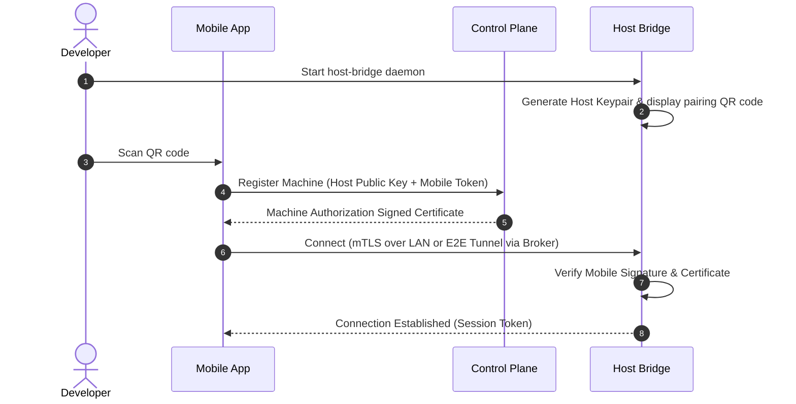
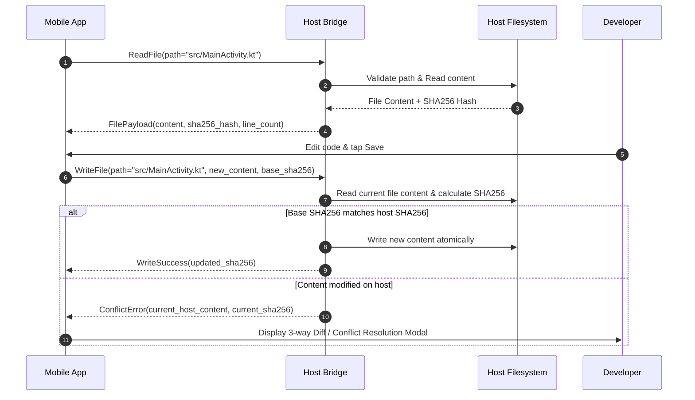
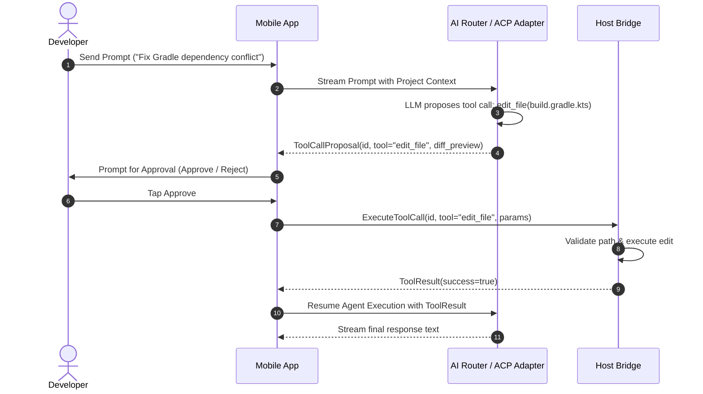

# DevOrbit — Data Flow Specification

## 1. Machine Pairing & Authentication Flow

```mermaid
sequenceDiagram
    autonumber
    actor Developer
    participant Mobile as Mobile App
    participant CP as Control Plane
    participant Bridge as Host Bridge

    Developer->>Bridge: Start host-bridge daemon
    Bridge->>Bridge: Generate Host Keypair & display pairing QR code
    Developer->>Mobile: Scan QR code
    Mobile->>CP: Register Machine (Host Public Key + Mobile Token)
    CP-->>Mobile: Machine Authorization Signed Certificate
    Mobile->>Bridge: Connect (mTLS over LAN or E2E Tunnel via Broker)
    Bridge->>Bridge: Verify Mobile Signature & Certificate
    Bridge-->>Mobile: Connection Established (Session Token)
```

## 2. Remote Code Edit & Conflict Resolution Flow

```mermaid
sequenceDiagram
    autonumber
    participant Mobile as Mobile App
    participant Bridge as Host Bridge
    participant FS as Host Filesystem

    Mobile->>Bridge: ReadFile(path="src/MainActivity.kt")
    Bridge->>FS: Validate path & Read content
    FS-->>Bridge: File Content + SHA256 Hash
    Bridge-->>Mobile: FilePayload(content, sha256_hash, line_count)

    Developer->>Mobile: Edit code & tap Save
    Mobile->>Bridge: WriteFile(path="src/MainActivity.kt", new_content, base_sha256)
    Bridge->>FS: Read current file content & calculate SHA256
    alt Base SHA256 matches host SHA256
        Bridge->>FS: Write new content atomically
        Bridge-->>Mobile: WriteSuccess(updated_sha256)
    else Content modified on host
        Bridge-->>Mobile: ConflictError(current_host_content, current_sha256)
        Mobile->>Developer: Display 3-way Diff / Conflict Resolution Modal
    end
```

## 3. AI Agent Tool Execution Approval Flow

```mermaid
sequenceDiagram
    autonumber
    actor Developer
    participant Mobile as Mobile App
    participant Router as AI Router / ACP Adapter
    participant Bridge as Host Bridge

    Developer->>Mobile: Send Prompt ("Fix Gradle dependency conflict")
    Mobile->>Router: Stream Prompt with Project Context
    Router->>Router: LLM proposes tool call: edit_file(build.gradle.kts)
    Router-->>Mobile: ToolCallProposal(id, tool="edit_file", diff_preview)
    Mobile->>Developer: Prompt for Approval (Approve / Reject)
    Developer->>Mobile: Tap Approve
    Mobile->>Bridge: ExecuteToolCall(id, tool="edit_file", params)
    Bridge->>Bridge: Validate path & execute edit
    Bridge-->>Mobile: ToolResult(success=true)
    Mobile->>Router: Resume Agent Execution with ToolResult
    Router-->>Mobile: Stream final response text
```
